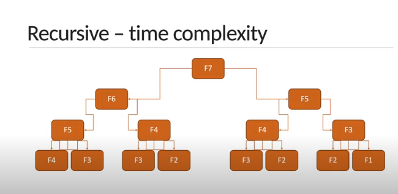

-   [Fibonacci sequence](#fibonacci-sequence)
-   [Factorial of an integer](#factorial-of-an-integer)
-   [Determine if the number is prime or not](#given-a-natural-number-n-determine-if-the-number-is-prime-or-not)
-   [Recursive Fibonacci sequence](#recursive-fibonacci-sequence)
-   [Recursive factorial of a number](#recursive-factorial-of-a-number)

# top

---

## Time complexity


---

# Fibonacci sequence

Give a number 'n',find the first 'n' elements of the fibonacci sequence
the first two number are 0 and 1

> fibonacci(2) = [0,1] <br>
> fibonacci(3) = [0,1,1] <br>
> fibonacci(7) = [0,1,1,2,3,5,8]

```js function fibonacci(num) {
    let fib = [0, 1];
    for (let i = 2; i < num; i++) {
        fib[i] = fib[i - 1] + fib[i - 2];
    }
    console.log(fib);
}
fibonacci(2);
fibonacci(3);
fibonacci(4);
fibonacci(7);
```

Big O = O(n) <br>

[go-top](#top)

# Factorial of an integer

> 2 = 2 \* 1 <br>
> 3 = 3 \* 2 \* 1 <br>
> 4 = 4 \* 3 \* 2 \* 1 <br>

```js
function factorial(num) {
let result = 1;
for (let i = 2; i <= num; i++) {
result = result \* i;
}
console.log(factorial(4););
}
```

Big O = O(n) <br>
[go-top](#top)

---

## Given a natural number 'n' determine if the number is prime or not

> prime number is a natural number greater than 1 that is not product of two smaller number <br>
> isPrime(5) = true(1*5 or 5*1) <br>
> isPrime(4) = false(1*4 or 2*2 or 4\*1)

```js function isPrimeNumber(n) {
if (n < 2) {
return false;
}

    for (let i = 2; i < n; i++) {
        if (n % i === 0) {
            return `${false} is not a prime number`;
        }
    }

    return true;

}
// console.log(isPrimeNumber(5));
// console.log(isPrimeNumber(15));
// console.log(isPrimeNumber(23));
```

big O = o(n) <br>

or

```js
function isPrimeNumberWithSqrt(n) {
    if (n < 2) {
        return false;
    }

    for (let i = 2; i <= Math.sqrt(n); i++) {
        if (n % i === 0) {
            return `${false} is not a prime number`;
        }
    }

    return true;
}
// console.log(isPrimeNumberWithSqrt(5));
// console.log(isPrimeNumberWithSqrt(15));
// console.log(isPrimeNumberWithSqrt(23));
```

Big-O = O(srt(n)) <br>
[go-top](#top)

---

## Power of two

> Given a +ve integer 'n' determine if the number is a power of 2 or not <br>
> An integer is a power of two if there exist an integer x such that n===2 <br>
> isPowerOTwo(1) = true (2⁰) <br>
> isPowerOTwo(1) = true (2¹) <br>
> isPowerOTwo(5) = false <br>

```js
function isPowerOTwo(n) {
    if (n < 1) {
        return false;
    }

    while (n > 1) {
        if (n % 2 !== 0) {
            return false;
        }
        n = n / 2;
    }
    return true;
}

// console.log(isPowerOTwo(2));
// console.log(isPowerOTwo(8));
// console.log(isPowerOTwo(9));
```

Input size reduce half therefore O(logn)

[go-top](#top)

---

# Recursive Fibonacci sequence

The Fibonacci is sequence in which each number is the sum of the two preceding

if F represents a function to calculate the fibonacci number,then

> F<sub>n</sub> = F<sub>n - 1</sub> + F <sub>n - 2</sub> <br>
> F<sub>0</sub> = 0 and F<sub>1</sub> = 1 <br>
> F<sub>2</sub> = F<sub>1</sub> + F<sub>0</sub> <br>
> F<sub>2</sub> = 1 + 0

```js
function recursiveFibonacci(n) {
    if (n < 2) return n;
    return recursiveFibonacci(n - 1) + recursiveFibonacci(n - 2);
}

console.log(recursiveFibonacci(0)); // 0
console.log(recursiveFibonacci(2)); // 1
console.log(recursiveFibonacci(6)); // 8
```



Big O = 2<sup>n</sup>

[go-top](#top)

---

# Recursive factorial of a number

**Problem** - Given an integer 'n', find the factorial of the integer

The factorial of a non-integer 'n', denoted n! , is the product of all positive integers less than or equal to 'n'.

factorial of zero is 1 <br>
factorial of 1 is 1

> 2 = 2 \* 1 <br>
> 3 = 3 \* 2 \* 1 <br>
> 4 = 4 \* 3 \* 2 \* 1 <br>
> n! = n × (n - 1)! x ....... x 1

Big O = linear time complexity o(n)

[go-top](#top)

---
